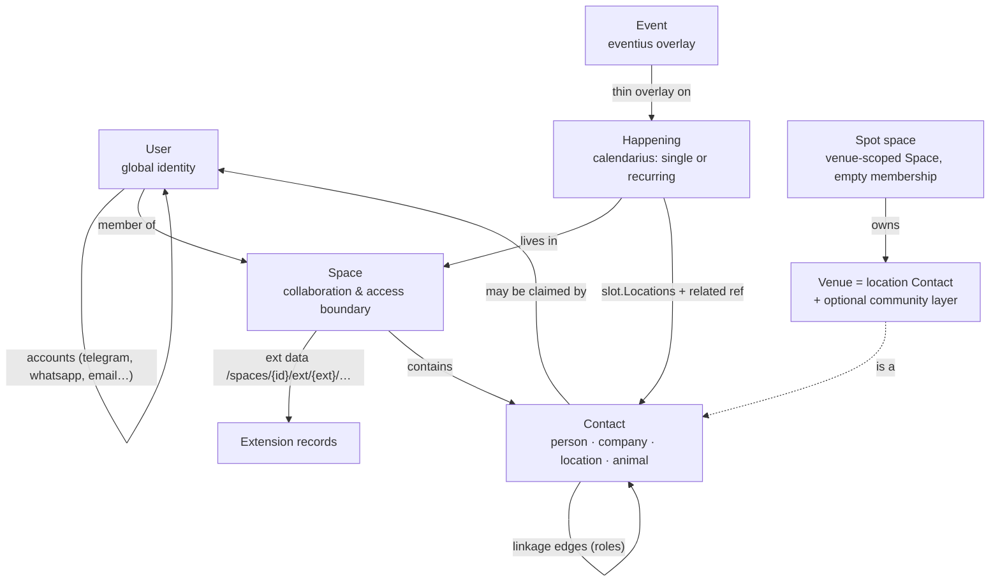

# Core Entities of the Sneat Platform — and how they relate

**Status:** Foundational reference — read this before building an extension
**Since:** 2026-07-16 · **Owner:** alex
**Audience:** anyone building or integrating a Sneat extension

Every Sneat extension composes the same small set of core entities. Building on
them — instead of inventing look-alikes — is what makes extensions consistent,
lets them share each other's data, and lets the UI reuse the same components
(one location picker, one contact selector, one participation control) across
every product. This document names those entities, pins their relations, and
records the composition patterns. When in doubt: **reuse a residing capability
before building anything new.**

## The entity map

## 1. User — the global identity

A **User** is a person's platform identity (`userus`). It is global (not inside
any space) and holds the person's **authentication accounts** — one user, many
channels: email, Google, Telegram, **WhatsApp** (a `wa_id` is a verified phone
number), etc. Bots resolve a channel identity to a user via the two-record
pattern (platform-scoped bot user → app user); a person arriving on a new
channel gets a user created silently — **no registration walls**. If one human
ends up with two users, they are joined through an explicit, confirmed
**merge** (`userus/mergeus`): propose → verify on the other channel → execute,
never silently, most-restrictive privacy winning.

A User is *not* a Contact. Users are who authenticates; contacts are who a
space knows about.

## 2. Space — the collaboration and access boundary

A **Space** (`spaceus`) scopes collaboration: family, company, club, private…
(`coretypes.SpaceType`). Everything a space owns lives under
`/spaces/{spaceID}/ext/{extID}/…`. Membership (`UserIDs`) governs default
access.

Two deliberate special shapes exist — **both are real, first-class spaces**:

- **The system namespace** — records that belong to *no* space (globally shared
  by design: invites, public games) live space-less at `/ext/{extID}/…`.
  Decision: [`spec/decisions/0002-reserved-extension-space-ids.md`](../spec/decisions/0002-reserved-extension-space-ids.md).
  A related-ref's `@{spaceID}` suffix is the sole discriminator: absent ⇒
  system namespace. Access is decided **per-record**, never by a namespace
  blanket.
- **Virtual / entity-scoped spaces** — a space whose "owner" is a *thing*, not
  a group of people, with **empty membership**: e.g. the **spot space**
  (`SpaceTypeSpot`, deterministic id `spot~{spotID}`) that owns a venue's
  shared records. Followers and contacts of such a space are **never members**
  — membership stays empty until real roles (e.g. moderators) justify it.

**Pattern — reuse residing-space capabilities:** an entity-scoped space gets the
whole module ecosystem for free. A venue's space holds its **calendar**
(opening hours, regular activities — calendarius), its **people** (regulars,
instructors — contactus), its lists, etc. Check the residing space's modules
before designing any bespoke structure.

## 3. Contact — person, company, **location**, animal

A **Contact** (`contactus`; public contract: `ext-contactus/backend`) is a
space-scoped record of someone or something the space knows:
`ContactTypePerson | ContactTypeCompany | ContactTypeLocation | ContactTypeAnimal`.

Key consequences people miss:

- **A place is a contact.** `ContactTypeLocation` is the platform's canonical
  place entity. Logistus (the logistics ERP) models every warehouse, port,
  dispatch/pick/drop point as a location contact referenced by `ContactID` +
  a domain **role** (`port_from`, `receive_point`, …) — it never invented a
  venue type. New extensions should do the same.
- **Contacts may be claimed.** An anonymous participant captured as a contact
  can later be claimed by a User (account linking / first-use back-prop),
  which routes through the same merge machinery as any identity join.
- **A contact is not membership.** Being a contact in a space (even a regular
  at a venue) grants no member access.

## 4. Venue — a location contact plus (optionally) a community layer

There is **no standalone Venue entity**, on purpose. A venue is composed:

| Layer | Entity | Example |
|---|---|---|
| Place identity (title, address, geo) | **location Contact** — owned by the venue's own space | "Lahinch Beach" |
| Community/ambient layer (optional) | a product's record referencing it (e.g. ToGethered **Spot**: followers, activities, day views) | the beach's kite crowd |
| The venue's time | **calendarius in the venue's space**: opening hours, regular activities | "open till sunset", Thursday basketball |
| The venue's people | **contactus in the venue's space**: regulars, instructors | — |

So yes: *a virtual space can be a venue, and the venue is represented as a
contact* — those are three views of one composition, not three entities.
Products that only need "where?" as a string may keep a string; the moment
structure is needed, upgrade to a location-contact reference — never a new
place type. This is also what makes **UI reuse** work: one location-entry
component, one venue picker, shared by every extension because they share the
same fields.

## 5. Happening — when something occurs (calendarius)

A **Happening** (`calendarius`; contract: `ext-calendarius/backend`) is the
when-record: `single` or `recurring` (weekly slots, weekday codes,
week-of-month; per-occurrence **adjustments** for cancel/modify one date).
Occurrence times are wall-clock in an IANA timezone.

- **Where does it happen?** `HappeningSlot.Locations` (`physical|online`,
  max one physical) plus the slot's `WithRelated` **ref to the place** — i.e.
  to a location contact / venue (§4). Don't add location fields elsewhere.
- **What kind?** `HappeningKind` is open: `event` (hosted — Eventius),
  `activity` (host-less recurring activity), etc. Kinds let products overlay
  meaning without forking the time model (`Ext[extID]` carries the overlay).

## 6. Event & the occasion family (eventius and friends)

An **Event** (`eventius`) is a happening (`kind=event`) plus a thin hosting
overlay: invitations, RSVP links/QR, hybrid anonymous/account identity.
Sibling products (RSVP.express verticals, GameBoard.live games, ToGethered
ambient plans) are members of one **occasion family** that shares:

- **The participation vocabulary** — `ext-eventius/backend`, package
  `participation`: the coarse scale (`yes|no|maybe`), the graded scale
  (`no|unlikely|maybe|likely|yes`), the canonical mappings, and the domain
  alias renderings (`available|unavailable|maybe`, `going|maybe|out`).
  **Never mint a new response scale** — add an alias rendering if a domain
  needs different words.
- **Attend-not-join** — responding to / attending an occasion NEVER grants
  space membership. Participation leaves **linkage** residue only (§7).
- Response *records* stay per-product (a parent-proxy game RSVP and a
  household headcount RSVP are legitimately different shapes) — only the
  scale is shared.

## 7. Linkage — the relationship graph

**Linkage** (`sneat-core-modules/linkage`) records typed, directed-or-symmetric
relationship edges between records: family roles, `event-attendee ↔
event-host`, symmetric `co-attendee`, `follower → team/player`. Refs address
any record (`{extID}/{collection}/{id}` + optional `@{spaceID}`, per Decision
0002). **Role IDs are a shared vocabulary — reuse existing roles; declare new
ones centrally**, never as ad-hoc strings, or products drift into synonyms.

## 8. Cross-cutting patterns (the how)

- **Ports & adapters for extension backends** — an extension's backend is a
  **dalgo-only** Go module in its product repo (`<product>/backend`);
  platform/cross-extension needs are small ports; adapters live in the
  composition root (`sneat-go`, which stays wiring-and-configs only).
  Standard: [`extension-backend-architecture.md`](extension-backend-architecture.md).
- **Contract modules** — shared types/read-models live in versioned
  `ext-<id>/backend` modules (`ext-contactus`, `ext-calendarius`,
  `ext-eventius`, `ext-gameboard`); dependency-light, publicly buildable.
  Naming: [`repo-naming.md`](repo-naming.md).
- **Per-record authorization** — no namespace- or space-type-level blanket
  ACLs (Decision 0002); each record's own policy decides.
- **One vocabulary, many renderings** — scales, roles and place types are
  defined once; products render them in their own words (participation
  aliases; the same location contact behind different domain roles).
- **Reuse UI by reusing entities** — shared entry/selection components
  (location, contact, participation) come free exactly where extensions share
  the underlying entity; every bespoke entity forks the UI too.

## Related reading

- [`extension-backend-architecture.md`](extension-backend-architecture.md) — the ports-&-adapters standard
- [`repo-naming.md`](repo-naming.md) — products, `ext-<id>` contract repos, discovery topics
- [`../spec/decisions/0002-reserved-extension-space-ids.md`](../spec/decisions/0002-reserved-extension-space-ids.md) — system namespace, refs, per-record authorization
- [Frontend UX standards](frontend-ux/README.md) — the shared UI components this consistency pays for
